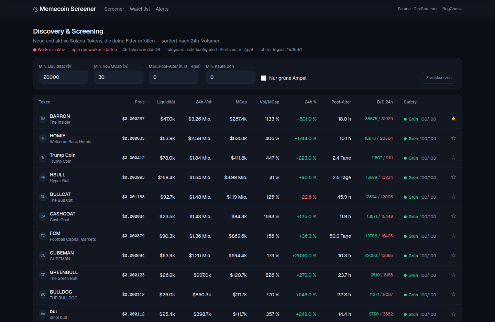

# Memecoin Screener & Alert Dashboard

Discovery-, Screening- und Risk-System für **Solana**-Memecoins mit Push-Alerts aufs Handy (Telegram) und KI-Copilot.

> **Was das Tool NICHT ist:** ein Predictor. Kein Modul sagt „Gewinner von morgen" voraus. Der Edge liegt in *Geschwindigkeit* (früher sehen) und *Filterung* (Müll + Scams rauswerfen). Ein grüner Safety-Score bedeutet nur „kein sofortiges Rug-Signal aus den verfügbaren Daten erkennbar" — niemals „sicher". Keine Anlageberatung.



## Features

- **Discovery-Feed** — neue & aktive Solana-Pools von DexScreener (Token-Profile, Boosts, Trending), automatisch alle 60 Sek. aktualisiert
- **Screening-Filter** — Min. Liquidität (Default $20k), Vol/MCap-Ratio (Default 30 %), Pool-Alter, Min. Käufe; alle einstellbar
- **Risk-/Safety-Ampel** — Heuristiken aus Marktdaten (Honeypot-Signatur, Fake-Volume, MCap/Liquiditäts-Missverhältnis, Crash-Erkennung) + **RugCheck.xyz**-Anreicherung (Mint-/Freeze-Authority, Holder-Konzentration, Insider-Netzwerke)
- **Alerts** — eigene Regeln: „Token erfüllt alle Filter **und** Ampel ist grün → Push per Telegram". Dedup pro Token+Regel über einstellbaren Cooldown
- **Watchlist + Rug-Frühwarnung** — Liquiditäts-Drop-Alarm (🚨 Rug im Gange), Volumen-Spike-Erkennung
- **KI-Copilot** — „Warum diese Bewertung?", 3-Satz-Briefing, Frag-die-Daten. Antwortet ausschließlich auf Basis der DB-Metriken (Grounding), mit Anti-Predictor-Guardrail

## Schnellstart

> **Kein PC zur Hand (iPad/Handy)?** Siehe **[DEPLOY.md](DEPLOY.md)** — Schritt-für-Schritt-Anleitung,
> um das Dashboard **kostenlos** und komplett im Browser online zu stellen
> (Vercel + Neon + cron-job.org → eigener Link, läuft 24/7).

Lokal (Voraussetzung: Node.js 20+ und eine Postgres-URL, kostenlos z. B. von [neon.tech](https://neon.tech)):

```bash
npm install
cp .env.example .env        # DATABASE_URL eintragen
npx prisma migrate dev      # legt die Tabellen an

# Terminal 1 — Backend-Worker (Ingest + Alert-Dispatcher)
npm run worker

# Terminal 2 — Web-App
npm run dev                 # http://localhost:3000
```

Nach ~1 Minute füllt der Worker die DB mit den ersten Tokens.
Ganz ohne Postgres basteln? SQLite-Umstellung: siehe Kommentar in `prisma/schema.prisma`.

## Telegram-Alerts einrichten (optional)

1. In Telegram [@BotFather](https://t.me/BotFather) öffnen → `/newbot` → Token kopieren
2. Deinem neuen Bot irgendeine Nachricht schicken
3. `https://api.telegram.org/bot<DEIN_TOKEN>/getUpdates` im Browser öffnen → `chat.id` ablesen
4. Beides in `.env` eintragen (`TELEGRAM_BOT_TOKEN`, `TELEGRAM_CHAT_ID`), Worker neu starten

Ohne Telegram-Konfiguration werden Alerts trotzdem erzeugt und unter **Alerts** in der App angezeigt.

## KI-Copilot einrichten (optional)

API-Key von [console.anthropic.com](https://console.anthropic.com) in `.env` als `ANTHROPIC_API_KEY` eintragen und App neu starten. Der Key bleibt server-seitig — er landet nie im Browser.

## Architektur

```
[ Datenquellen ]        [ Backend-Worker ]          [ Frontend ]
DexScreener API   →   Ingest (Polling + Scoring) →  Next.js Dashboard
RugCheck (SOL)    →   Alert-Dispatcher           →  Telegram-Bot (Push)
                          ↓                          ↑
                      SQLite/Postgres (Prisma) → KI-Copilot (Anthropic API)
```

Drei getrennte Prozesse (Konzept-Kapitel 2):

| Prozess | Aufgabe | Start |
|---|---|---|
| **Ingest-Worker** | pollt DexScreener (rate-limit-konform: max 250/min bzw. 50/min), berechnet Scores, reichert Top-Kandidaten mit RugCheck an, schreibt alles in die DB | `npm run worker` |
| **Alert-Dispatcher** | prüft alle ~45 Sek. Regeln + Watchlist, verschickt Treffer, dedupliziert | läuft im selben Prozess mit |
| **Web-App** | liest **nur** aus der DB, nie direkt aus den APIs (schont Rate-Limits) | `npm run dev` |

Für das Hosting gibt es zwei weitere Betriebsmodi:
- `EMBEDDED_WORKER=true` — Worker läuft im Webserver mit (ein einziger Dienst, z. B. Railway)
- `GET /api/cron?key=<CRON_SECRET>` — ein externer Cron-Dienst stößt Ingest + Dispatch an
  (serverlos, fürs kostenlose Vercel-Hosting; Route ist per `CRON_SECRET` geschützt)

### Wichtige Dateien

```
prisma/schema.prisma        Datenmodell (tokens, pairs, snapshots, scores, rules, alerts, watchlist)
worker/ingest.ts            DexScreener-Polling + Scoring + RugCheck
worker/dispatcher.ts        Alert-Regeln, Rug-Frühwarnung, Telegram-Versand
src/lib/scoring.ts          Risk-/Safety-Scoring (Ampel-Logik)
src/lib/screening.ts        Filter-Logik (von App UND Dispatcher genutzt)
src/app/api/copilot/        KI-Copilot mit Grounding + Anti-Predictor-System-Prompt
```

## Datenbank

Standard ist **PostgreSQL** (kostenlos z. B. bei [neon.tech](https://neon.tech)) — das braucht
auch das kostenlose Vercel-Hosting. Wer lokal ohne Postgres basteln will, stellt auf SQLite um:
`provider = "sqlite"` in `prisma/schema.prisma`, `DATABASE_URL="file:./dev.db"` in `.env`,
Ordner `prisma/migrations` löschen, dann `npx prisma migrate dev --name init`.

## Hinweise

- **DexScreener-Terms:** verbieten Produkte, die direkt mit DexScreener konkurrieren. Für den Eigengebrauch unkritisch — vor einer Veröffentlichung/Kommerzialisierung prüfen.
- **CoinGecko** (Security-Signale, OHLCV-Historie) ist im Konzept als spätere Produktions-Basis vorgesehen und kann als weitere Quelle in `worker/` ergänzt werden.
- Alert-Regeln erzwingen immer die grüne Ampel (Konzept 4.4).

## Roadmap-Status

- [x] Phase 1 — MVP: Discovery-Feed, Filter, Risk-Ampel (DexScreener)
- [x] Phase 2 — Safety-Scores (RugCheck) + Telegram-Alerts + Dedup
- [x] Phase 3 — Watchlist, Liquiditäts-Drop- & Volumen-Spike-Frühwarnung
- [x] Phase 4 — KI-Copilot (geerdet auf DB-Metriken, Anti-Predictor-Guardrail)
